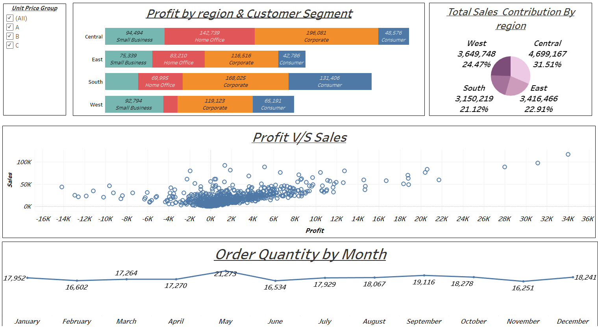

# 📊 Tableau Dashboard README

## Dashboard Title: **Sales & Profit Analysis by Region and Segment**

### 📁 Overview
This Tableau dashboard provides a comprehensive visual analysis of sales performance, profit distribution, and order quantities across different regions, customer segments, and months. It helps stakeholders gain insights into key metrics and performance trends to make data-driven decisions.

---

### 🧩 Dashboard Components

1. ### **Unit Price Group Filter**
   - Located on the top-left.
   - Allows users to filter data based on unit price groups (A, B, C).
   - Default: All groups are selected.

2. ### **Profit by Region & Customer Segment**
   - Horizontal stacked bar chart.
   - Visualizes **profit contribution** from each customer segment (Small Business, Home Office, Corporate, Consumer) within four regions (Central, East, South, West).
   - Enables comparison of profitability across segments and regions.

3. ### **Total Sales Contribution by Region**
   - Pie chart displaying each region’s **contribution to total sales**.
   - Includes absolute values and percentages.
     - Central: 4,699,167 (31.51%)
     - West: 3,649,748 (24.47%)
     - East: 3,416,466 (22.91%)
     - South: 3,150,219 (21.12%)

4. ### **Profit vs Sales Scatter Plot**
   - Analyzes the **relationship between profit and sales**.
   - Each data point represents an individual order or transaction.
   - Useful for spotting outliers and understanding general profit trends.

5. ### **Order Quantity by Month**
   - Line chart tracking **order volumes over 12 months**.
   - Highlights monthly fluctuations.
   - Peak in May with 21,273 orders.
   - Lowest in June with 16,534 orders.

---

### 🎯 Key Insights
- **Central region** dominates in sales contribution.
- **Corporate segment** tends to have the highest profits across regions.
- Profit and sales show a **positive but scattered** relationship — not always linear.
- Order quantity sees **seasonal trends**, peaking mid-year and dipping in early summer and late fall.

---

### 🔧 How to Use
- Use the **Unit Price Group filter** to dynamically adjust the visualizations.
- Hover over charts for **tooltips and exact values**.
- Identify high-performing regions and segments to inform strategy.

---

